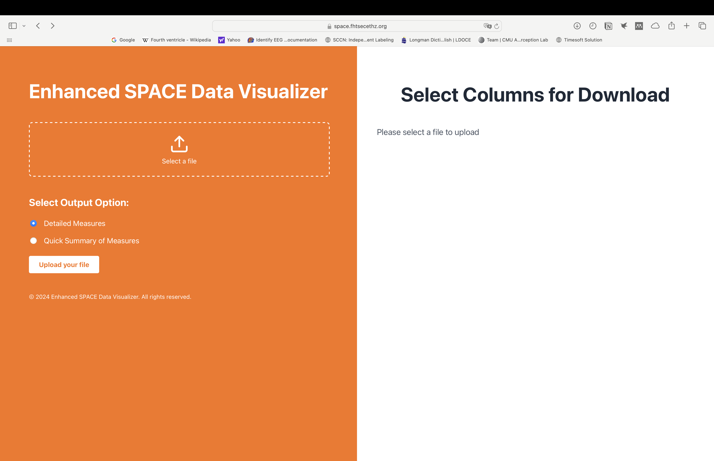

# Website Usage Guide

Welcome to our website! This guide will walk you through the steps to upload a JSON file, select the desired data columns, and download the data as a CSV file.

---

## Table of Contents

1. [Accessing the Website](#accessing-the-website)
2. [Uploading a JSON File](#uploading-a-json-file)
3. [Selecting Data Columns](#selecting-data-columns)
4. [Downloading the CSV File](#downloading-the-csv-file)
5. [Notes on Column Groups](#notes-on-column-groups)
6. [Troubleshooting](#troubleshooting)
7. [Contact Support](#contact-support)

---

## Accessing the Website

1. **Open your web browser** and navigate to the website URL: https://space.fhtsecethz.org
   

2. **Ensure you have a stable internet connection** for the best experience.

---

## Uploading a JSON File

1. **Locate the Upload Section** on the homepage.

2. **Click on the "Choose File" button** to open the file selector dialog.

3. **Navigate to the JSON file** on your computer that you wish to upload.

4. **Select the JSON file** and click **"Open"**.

5. **Click on the "Upload" button** to start the upload process.

6. **Wait for the upload to complete**. A confirmation message will appear once the file is successfully uploaded.

---

## Selecting Data Columns

1. **After uploading**, you will see a list of available **Column Groups** on the left side of the page.

- The column groups may include:
  - `Player`
  - `Training`
  - `Path Integration (PI)`
  - `Egocentric Pointing`
  - `Mapping`
  - `Memory`
  - `Perspective Taking`
  - `Overall Measures`

2. **Expand a Column Group** by clicking on it to see the individual columns.

3. **Select the Columns** you wish to include in your CSV file by checking the boxes next to them.

- You can select individual columns or entire groups.
- Note that some groups might not be available if they are not present in your JSON file.

4. **Review your selections**. Selected columns will be highlighted or marked with a check.

---

## Downloading the CSV File

1. **Once you have made your selections**, locate the **"Download"** button at the bottom of the column selection panel.

2. **Click on the "Download" button** to generate and download the CSV file.

3. **Save the CSV file** to your desired location on your computer.

4. **Open the CSV file** with your preferred spreadsheet application to view the data.

---

## Notes on Column Groups

- **Availability of Column Groups**: Some column groups may not appear if they are not present in the uploaded JSON file.

- **Calculated Averages**:

- The groups **`Path Integration (PI)`**, **`Egocentric Pointing`**, and **`Perspective Taking`** include subcolumns named **`averages`**.
- These averages are calculated based on data from other groups.
- Ensure that the necessary data is present in the JSON file for accurate calculations.

---

## Troubleshooting

- **No Columns Available**: If no columns appear after uploading, verify that your JSON file contains the correct data structure.

- **Download Button Disabled**: Ensure you have selected at least one column before attempting to download.

- **Error Messages**: If you encounter any error messages, please check the following:

- The JSON file is correctly formatted.
- All required data fields are present.
- Your internet connection is stable.

---

## Contact Support

If you have any questions or need assistance, please contact our support team at:

- **Email**: support@examplewebsite.com
- **Phone**: +1 (123) 456-7890

---

**Thank you for using our website!**

---
